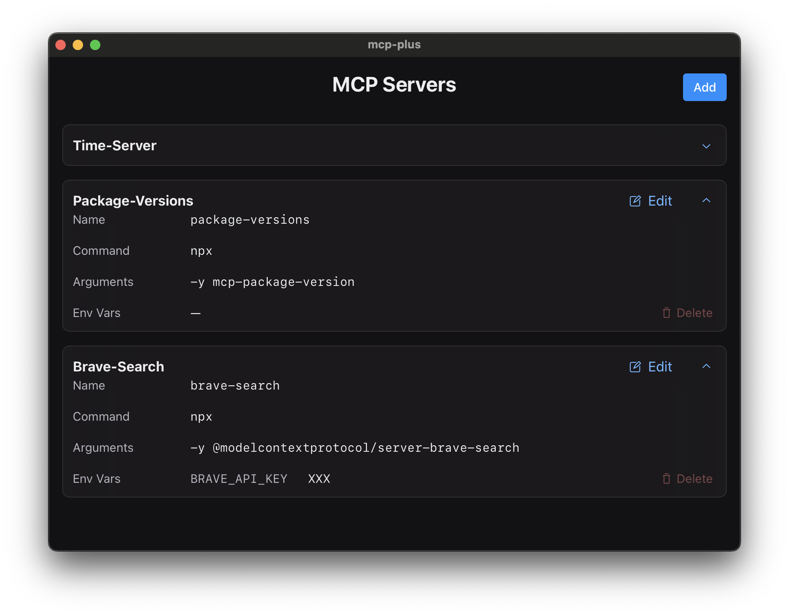

# Claude MCP Config Editor

> A native macOS app for managing [MCP](https://modelcontextprotocol.io) servers in the Claude desktop application

## Features

- 🖥 Native macOS interface designed specifically for managing MCP servers
- 🔐 Local-first: All configurations stay on your machine
- 👆 Point-and-click interface - no command line needed
- ⚙️ Visual configuration of server settings and environment variables
- 🚀 Seamless integration with Claude desktop app

## Installation

The MCP Config Editor is currently available for macOS, with Windows support coming soon. Download the latest version and follow the installation prompts to get started.

| Platform | Status    | Download                   |
|----------|-----------|----------------------------|
| macOS    | ✅        | **[Download for Mac](https://github.com/silentcastledev/mcp-plus/releases/download/v0.1.0/MCP.Plus_0.1.0_universal.dmg)** |
| Windows  | 🚧 Soon   | —                          |

## What is MCP?

The Model Context Protocol (MCP) extends Claude's capabilities by allowing it to interact with your local environment, APIs, and services. This enables Claude to:

- Access and analyze your private data
- Interact with your local tools and services
- Perform actions on your behalf through custom integrations

Learn more about MCP:
- [Official MCP Documentation](https://modelcontextprotocol.io)
- [Anthropic's MCP Announcement](https://www.anthropic.com/news/model-context-protocol)

## Contributing

This application is built using the [Tauri](https://tauri.app) framework, combining Rust's performance with web technologies.

We welcome contributions of all kinds:
- New features and enhancements
- Bug fixes and performance improvements
- Documentation and examples
- UI/UX improvements

Please feel free to submit pull requests or open issues for discussion.

## License

This project is licensed under the Apache License, Version 2.0. You are free to use, modify, and distribute the software, either in source or binary form, subject to the terms and conditions of the Apache License 2.0. See the LICENSE file for full details.
